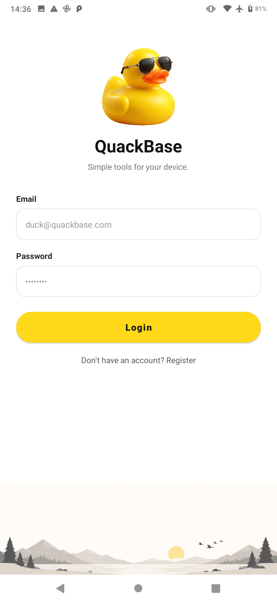
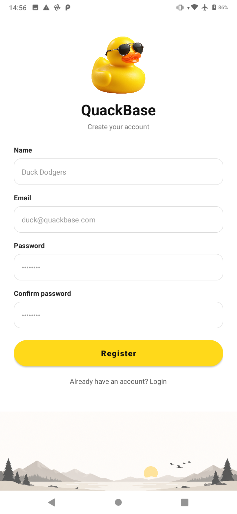
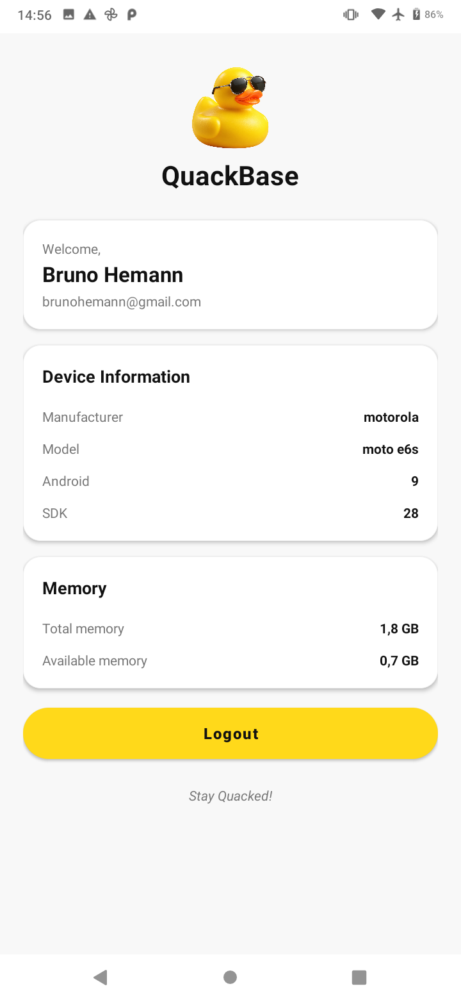

# QuackBase

QuackBase é um aplicativo Android simples para autenticação de usuários e consulta de informações básicas do dispositivo. O app utiliza Firebase Authentication para cadastro com nome, login, recuperação de sessão e logout.

## Funcionalidades

- Cadastro com nome, e-mail e senha
- Nome do usuário salvo no perfil e exibido no Dashboard
- Login com e-mail e senha
- Sessão de usuário persistente
- Logout seguro
- Exibição do fabricante e modelo do dispositivo
- Versão do Android e nível da SDK
- Memória total e disponível
- Validação dos campos e tratamento de erros de autenticação

## Telas

O fluxo principal passa pela apresentação do app, autenticação e painel de informações do dispositivo. O nome informado durante o cadastro é apresentado na área de boas-vindas do Dashboard.

<table>
  <tr>
    <th>Tela inicial</th>
    <th>Login</th>
  </tr>
  <tr>
    <td></td>
    <td></td>
  </tr>
  <tr>
    <th>Cadastro</th>
    <th>Informações do dispositivo</th>
  </tr>
  <tr>
    <td></td>
    <td></td>
  </tr>
</table>

## Tecnologias

- Kotlin
- Android SDK e layouts XML
- AppCompat e Material Components
- Firebase Authentication
- Firebase Analytics
- Gradle Kotlin DSL

## Requisitos

- Android Studio
- JDK 17
- Android SDK
- Dispositivo ou emulador com Android 9 (API 28) ou superior

## Como executar

1. Clone o repositório.
2. Abra o projeto no Android Studio.
3. Aguarde a sincronização do Gradle.
4. Selecione um emulador ou dispositivo físico.
5. Execute o módulo `app`.

Também é possível gerar o APK de desenvolvimento pelo terminal:

```bash
./gradlew assembleDebug
```

O APK será criado em `app/build/outputs/apk/debug/app-debug.apk`.
